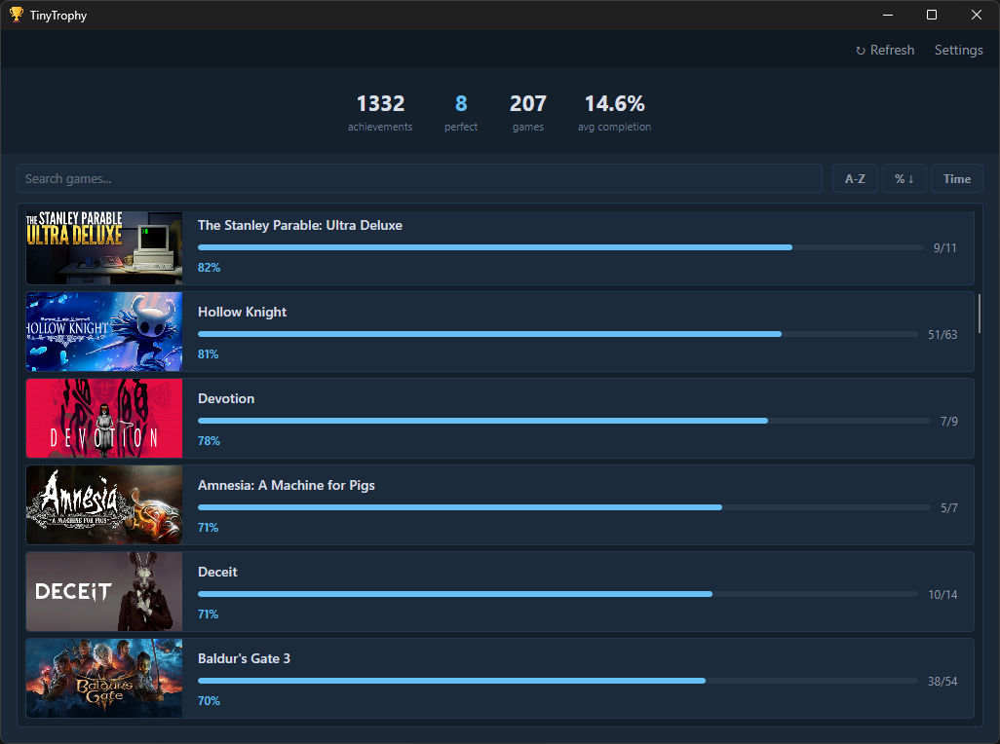
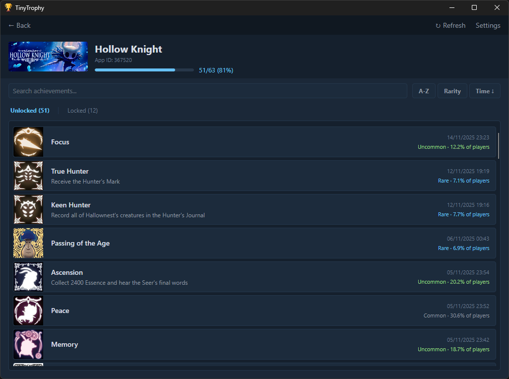

# Tiny Trophy

A lightweight achievement tracker that monitors your games across multiple platforms — all in a single, portable executable.

<table>
	<td align="left">
		
	</td>
	<td align="left">
		
	</td>
</table>

## Features

- **Multi-platform support** — Track achievements from Steam, Steam emulators, and PS4 games via ShadPS4
- **Truly lightweight** — Uses ~100 MB of RAM with a native UI that won't slow down your system while gaming
- **Single portable executable** — No installer, no runtime to pre-install, no dependencies to manage
- **Real-time notifications** — Get desktop popups (with optional sound) the moment you unlock an achievement
- **Live monitoring** — Watches your achievement folders for changes so progress is always up to date
- **Auto-updates** — Checks GitHub for new releases and lets you update in one click

## Why Lightweight Matters

Tiny Trophy is designed to stay out of your way while you game. It uses native desktop technology — no bundled browser engine, no hidden background processes eating into your system resources.

- **~100 MB of RAM** — Leaves more memory available for your game to use on textures, world streaming, and smoother frame pacing.
- **Minimal CPU usage** — Your processor stays focused on your game, not on rendering a tracker UI in the background.
- **No stutters or frame drops** — Runs silently without competing for GPU composition or system resources while you play.

## Download

Grab the latest release from the [Releases](https://github.com/giovanni-bozzano/tiny-trophy/releases) page.

No installation needed — just download and run.

## Getting Started

1. Download the latest release from the link above
2. Run **TinyTrophy.exe**
3. Follow the initial setup to configure your sources. Enter your Steam API key and Steam ID to track your official achievements
4. Right-click the tray icon to enable **Run on startup** and **Start minimized**

## Supported Sources

| Source | Description |
|--------|-------------|
| Steam (Official) | Your real Steam library via the Steam Web API |
| Steam (Emulator) | Achievement files from Steam emulators (see list below) |
| ShadPS4 | PS4 trophies from the [ShadPS4](https://github.com/shadps4-emu/shadPS4) emulator |

### Supported Steam Emulators

The following emulator folders are detected automatically on first launch:

| Emulator | Default Path |
|----------|-------------|
| Goldberg | `%AppData%\Goldberg SteamEmu Saves` |
| GSE | `%AppData%\GSE Saves` |
| OnlineFix | `%CommonDocuments%\OnlineFix` |
| RUNE | `%CommonDocuments%\Steam\RUNE` |
| CODEX (AppData) | `%AppData%\Steam\CODEX` |
| CODEX (Public Documents) | `%CommonDocuments%\Steam\CODEX` |
| EMPRESS (AppData) | `%AppData%\EMPRESS` |
| EMPRESS (Public Documents) | `%CommonDocuments%\EMPRESS` |
| SmartSteamEmu | `%AppData%\SmartSteamEmu`
| Anadius LSX | `%LocalAppData%\anadius\LSX emu\achievement_watcher` |
| SKIDROW | `%LocalAppData%\SKIDROW` |

### Custom Folders

You can also add your own custom folders from the settings page. Any folder that contains subfolders named by Steam AppID with achievement files will be picked up automatically. Each folder can be individually enabled or disabled.

## Building from Source

Requirements: [.NET 10 SDK](https://dotnet.microsoft.com/download)

```bash
git clone https://github.com/giovanni-bozzano/tiny-trophy.git
cd tiny-trophy
dotnet publish -c Release
```

The output is a single portable executable in `src/bin/Release/net10.0-windows/win-x64/publish/`.

## Acknowledgements

Inspired by [Achievement Watcher](https://github.com/xan105/Achievement-Watcher) by xan105.
